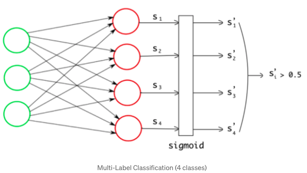

## Multi Class Classification for images

- The only difference between Uni-Class and Multi-Class Classification task is that data sampls can belong to multiple classes. 

### How to do
- **Activation**: We use the **sigmoid** function, not softmax on the final layer. Because we don't need the score taking others into consideration. Using sigmoid, we set 0.5 as the threshold. If output score is more than 0.5, it would be classified into that class. Otherwise, it would be not.

  

### A problem of Data Imbalance 

The Data Imbalance is the case that some classes are more than others in a dataset, so it might make the neural model to predict tendentiously the frequent classes. There are a lot of research to resolve this data imbalnce problem in multi-label classification. Among them, we use the popular resolution SMOTE.

### Experiments

I used extremely small data for image classification. (only 5)
 
| Architecture | Train Loss | Test Loss |
|-------|-------|-------|
|MLP| 0.282 ||
|gMLP| 7e-4 ||

- gMLP is better lol :D

### References 
[1] https://towardsdatascience.com/multi-label-image-classification-with-neural-network-keras-ddc1ab1afede  

[2] https://medium.com/the-owl/imbalanced-multilabel-image-classification-using-keras-fbd8c60d7a4b  

[3] Liu, Hanxiao, et al. "Pay Attention to MLPs." arXiv preprint arXiv:2105.08050 (2021).  

[4] https://github.com/antonyvigouret/Pay-Attention-to-MLPs/blob/master/models.py

### My Presentation for this paper [3]

https://www.youtube.com/watch?v=ojHBh2bE2BY
